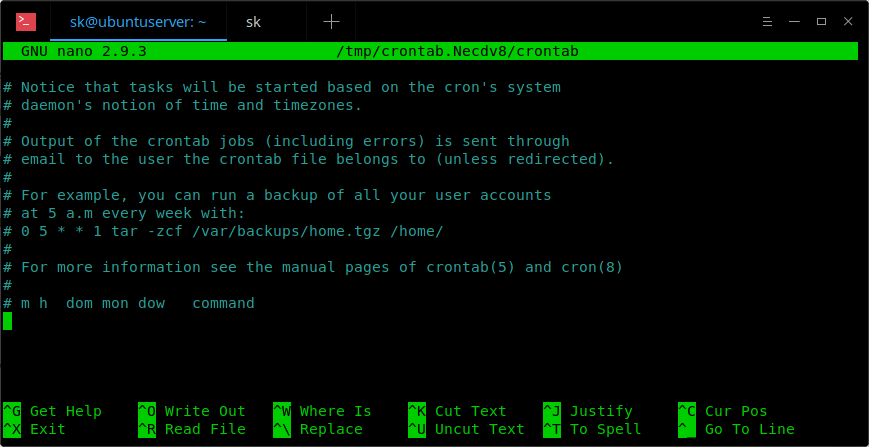
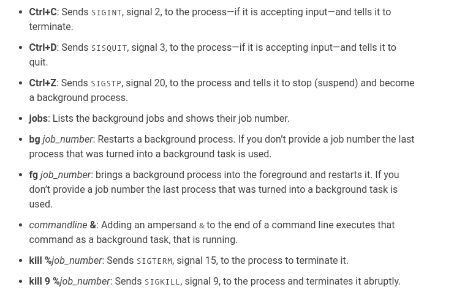

# Some Basic Linux Commands

> Docs on linux commands

## Basics

```bash
# To find the hidden files
ls -a

# To find the permissions and etc
ls -l

# Combined
ls -la

```

- **"."** means current directory.

- **".."** means parent directory.

- **pwd** means the location.

- **cd** for changing directory.

- **ls** for showing a list of all the files in the directory.

- **ls** -la for showing the list of files in list format + showing all the hidden files.

- **mkdir** for making a new directory.

- **touch** for creating a new file.

- **cp** for copying a file.

- **cp** -r for copy a directory.

- **mv** for renaming and / or moving a file.

- **open** for opening a file.

- **rm** for removing a file.

- **rm** **-rf** for force removing a directory.

- **man** (-r) this will show some information about -r. -r is an example.

## Compile a cpp or c files

```bash
g++ main.cpp -o main

# or
gcc main.cpp -o main

# Then execute the main file by typping
./main
```

## How to Use the \_find Command

```bash
# To find files in the sub directory
# this also finds and shows all the files on the sub directory
find .

# We can specify with a name
find JS # etc

# To find all the directories but no files
find . -type d

# To specify Type of search we can add directories after -type

# Find only files
find . -type f

```

## Package Managers

- Ubuntu and Linux uses the **apt** repositories or package managers.

- CentOS uses the **yum** and Arc uses something else.

- Whenever we want to install or remove something from apt we just use **install** or **remove** tags after writing apt.

- Suppose we dont know a package whether it's located or not on the apt repo we can easily find using name type of the program that we want to use. L

- Suppose we want to install php-mbstring from apt repo, so we can search it and also we can use the right name to install that specific package.

```bash
sudo apt search php-mbstring

# or

sudo apt search *-mbstring*

# or sudo apt search *-mbstring.*
```

## Permissions on linux

- Sometimes we need to explicitly give permissions to a specific file or folder to use them as **`owner or groups or other`** users.

- For that we use the `chmod` command and following `-R` and permission value `777` or any other value.

- Use online chmod calculator to verify the proper chmod number that you want to use.

## Cron Jobs

- **Cron** is a utility that we can find in any Unix like Operating System.

- It is used to schedule commands at a specific time.

- This scheduled commands are known as **"Cron Jobs"**.

- The code format is given below.

```bash
Minute(0-59) Hour(0-24) Day_of_month(1-31) Month(1-12) Day_of_week(0-6) Command_to_execute
```


- To display the contents of the **crontab** file of the currently logged in user.

```bash
crontab -l
```

- To edit the current user's cron jobs

```bash
crontab -e
```

- If it's the first time then you will be asked to choose an editor.

```bash
Select an editor. To change later, run 'select-editor'.
 1. /bin/nano <---- easiest
 2. /usr/bin/vim.basic
 3. /usr/bin/vim.tiny
 4. /bin/ed

Choose 1-4 [1]:
```



- On this file you need to add your **cronjobs** one by one.

- To remove the **cronjobs** type

```bash
crontab -r
```

- Use online cronjob generator for more details [crontab.guru](https://crontab.guru/).

## Compressing in linux

- Linux has some cool compression tools like **gzip**, **tar** pre installed.

- **zip** is also installed but it's too much known to all.

- **Gzip** is the best compression for compression single files.

- If we want to create a compressed file containing multiple files then we must use **zip** or **tar** commands.

- To zip multiple files into a single file

```bash
tar -czvf file.tar.gz directory_or_file_extensions
```

- To unzip files

```bash
tar -xzvf file.tar.gz directory_or_file
```

## Manage Process

- To manage a process we can use different commands like `top`, `toptree` etc.

- To terminate `ctrl+c`

- To quit `ctrl+d`

- To push it to the background `ctrl+z`

- Lists the background jobs and shows their job number `jobs`

- Shows the active background jobs `bg`

- Brings a background process and uses it in foreground `fg`

- To kill the process `kill`

- To kill a specific process we need to provide the process number `kill %job_number`

- To kill a process and terminate it abruptly `kill 9 %job_number`

- Here is a detailed look



- For more info visit [This link](https://man7.org/linux/man-pages/man7/signal.7.html)
