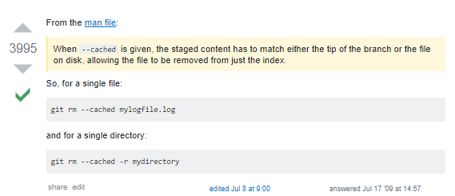

# Some Basics

### Publish a webpage on *GitHub Pages*	
 To publish a webpage on github pages we can simply name the repositry on this syntax __username.repoName.io__ or we can just go to the settings page and there is an option for publish our webpage on github pages. 

### Git Basics:
 To completely remove a tracked folder or file from being tracked again.
 


### Linux commands 

* To know any commands just type 
```bash 
man cp
```

* systemctl - this commands uses for various system purpose. 
```bash
sudo systemctl status apache2
```

* pwd - print working directory 

* mkdir - make directory 

* ls -a - show all folder and files including hidden files. 

* To copy a file : 
```bash 
cp target_file new_file
```

* To move a file : this also renames the file
```bash 
mv target_file new_file
```

* To move within a directory : 
```bash 
mv targetfile target_directory
```

* To delete a file : just rm directory/file name **beware there is no asking so there gone means gone** 

* To copy a directory we need to use **-R**. It mainly forces our commands. 

* **Find Command**: just uses the find command. there are lots of options on find
```bash 
# find all directories on current directory
find . -type d 
# find all files on current directory
find . -type f
# find file with a name on current directory 
find . -type f -name "filename.txt"
# using wild card or same name which i dont know 
find . -type f -name "samename*"
# -name is case sensitive so make it insensitive 
find . -type f -iname "test*" 

```  

* Files that are modified: We can also find this files using time limit. like files that are modified in the last hour or 10 minutes etc. 
```bash 
find . -type f -min -10
```
